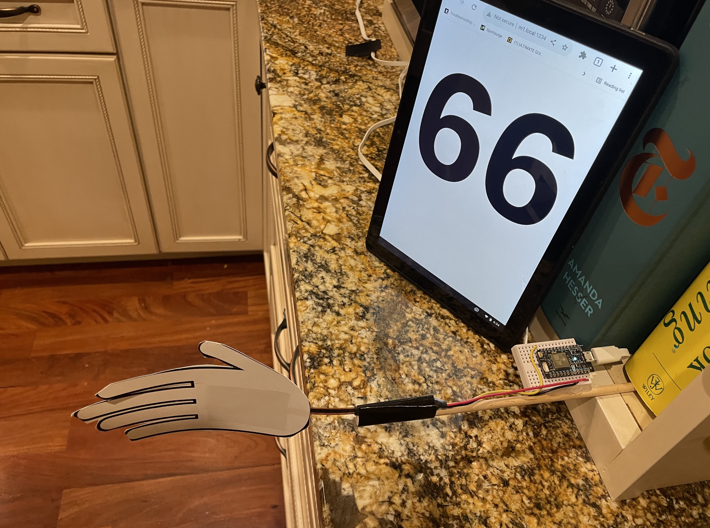

# Slappo
A high five counter. 

[Demo](https://www.instagram.com/p/Ca9zmjnFvC2/)

## How it works

There are two pieces to Slappo:

### 1. Sensor

* The Arduino polls the bend sensor every 20 frames.
* If the bend being sensed has increased by more than 250 bend units, and a slap hasn't happened within the past 500 milliseconds, we have a slap.
* It sends the slap as an event to Particle.
* Particle sends the slap to the browser.

### 2. Browser
The browser view is created using [node](https://nodejs.org/en/) / [Parcel](https://parceljs.org/).  

* The browser listens to Particle for slap updates.
* When it gets an update, it increments a counter.
* You can run the browser with `npm run dev` 

## Bend Sensor
I'm not completely positive of the make/model of my bend sensor.  It has three wires for ground, 3v & signal.  Its bend range appears to go between ~2000-3000 with 2210 being its resting value.

## Environment variables

The build process is looking for:
* `PARTICLE_USER`
* `PARTICLE_PASS`

## Hardware

* [Particle Photon](https://store.particle.io/collections/wifi/products/photon)
* Bend Sensor, providing signal to A0 on the Photon.  I found mine at a [local surplus store](https://www.ax-man.com/).
* [Tiny Breadboard](https://www.adafruit.com/product/65)

## Particle Web IDE (source for Particle Photon)
https://go.particle.io/shared_apps/622976e7cc643600fdf8a394

